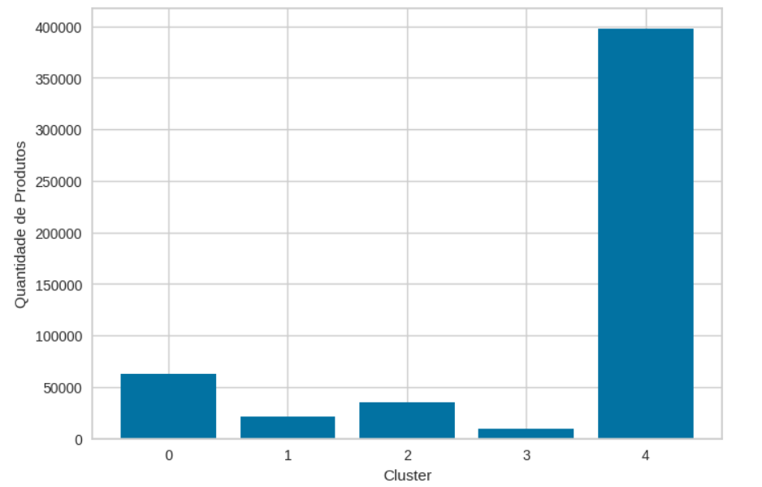
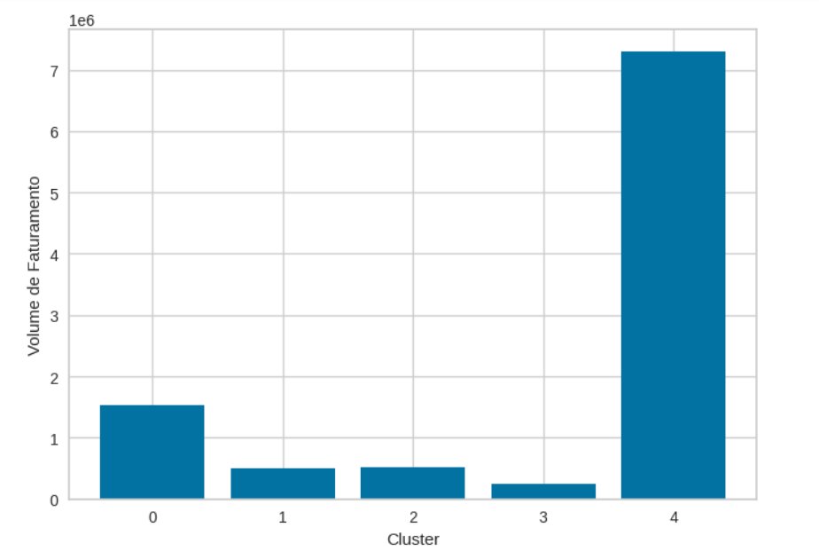
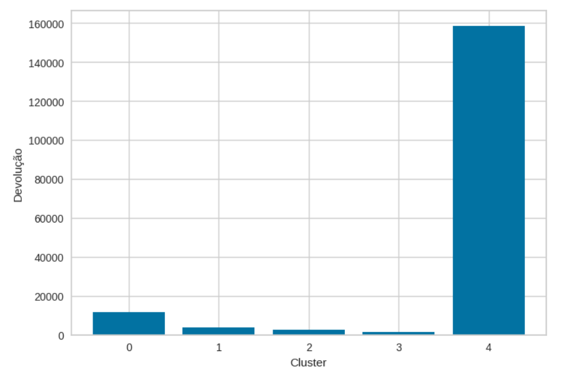
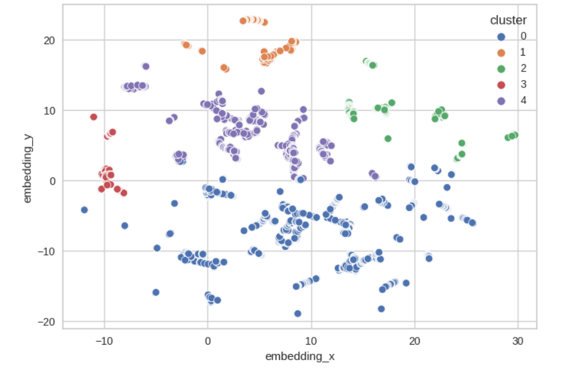
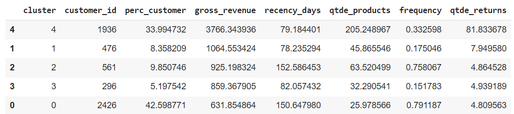

# Projeto: Programa de Fidelidade com Clusterização

    
  

    Foto de NASA na Unsplash

## 1.0. Descrição
Uma empresa que comercializa produtos de segunda linha de várias marcas a um preço menor, através de um e-commerce.

Com pouco mais de 1 ano de operação, o time de marketing percebeu que alguns clientes frequentemente compram produtos mais caros, e assim, contribuem com uma parcela significativa do faturamento da empresa.

Com base nessa percepção, o time de marketing vai lançar um programa de fidelidade para os melhores clientes da base. Mas o time de marketing não possui conhecimentos avançados em análise de dados para eleger os participantes do programa.

Por esse motivo, o time de marketing requisitou ao time de dados, uma seleção de clientes elegiveis ao programa usando técnicas avançadas de manipulação de dados.

## 2.0. Objetivo
Selecionar os mais valiosos clientes para formar o programa de fidelidade "INSIDERS" utilizando um conjunto de dados com as vendas de produtos entre Novembro de 2015 até Dezembro 2017.

## 3.0. Produto Final
Uma tabela, ordenada pelo faturamento total do cluster com suas características. O cluster com maior faturamento será considerado os clientes "INSIDERS".

## 4.0. Algoritmos Ensaiados
Realizei os ensaios com os algoritmos: Kmeans, Gaussian Mixture Model(GMM), Hierarchical Clustering e DBSCAN.  

## 5.0. Ferramentas Utilizadas
Python 3.8, Scikit-learn e SciPy.

## 6.0. Estratégia da Solução
Para conseguirmos identificar o grupo "INSIDERS", iremos utilizar a técnica para Feature Engineering: RFM (Recência, Frequência e Monetização). Após isso, iremos utilizar das métricas de validação WSS (Within-Cluster Sum of Square) e SS (Silhouette Score). Por último iremos fazer a visualização gráfica e separarmos os grupos entre INSIDERS e outros clusters.

## 7.0. O passo a passo
**Passo 01:** Realizar a Feature Engineering

**Passo 02:** Realizar ensaios com algoritmos de Machine Learning

**Passo 03:** Métricas de validação de Clustering

**Passo 04:** Análise de Cluster

## 8.0. Os top 3 insights
### 1. O cluster 4(insider) possuem um volume de compra maior comparados aos outros clusters.

### 2. O cluster 4(insider) possuem um faturamento de compras maior comparados aos outros clusters

### 3. O cluster 4(insider) tem a média de devoluções acima da média geral.

## 9.0. Resultados
Utilizei o modelo de Machile Learning Gaussian Mixture para encontrarmos os agrupamentos (clusterização) para esses dados.

Uma inspeção visual podemos entender os agrupamentos formados pelo modelo.

Por fim, podemos separar em informações relevantes para encontrarmos o grupo insiders, usando como referência o faturamento, e também de outros grupos para entregarmos para a equipe de negócios.

## 10.0. Conclusão
### Cluster Insider
    - Número de customers: 1182 (20% do customers )
    
    - Faturamento médio: $4367,00 dólares
    
    - Recência média: 96 dias
    
    - Média de Produtos comprados: 190 produtos
    
    - Frequência de Produtos comprados: 0.28 produtos/dia

## 11.0. Próximos Passos
Utilizar a computação em nuvem(AWS ou Google cloud), criar uma API com o modelo e colocarmos um local para "subir" novos dados e encontramos qual cluster esse novo cliente poderá fazer parte.
