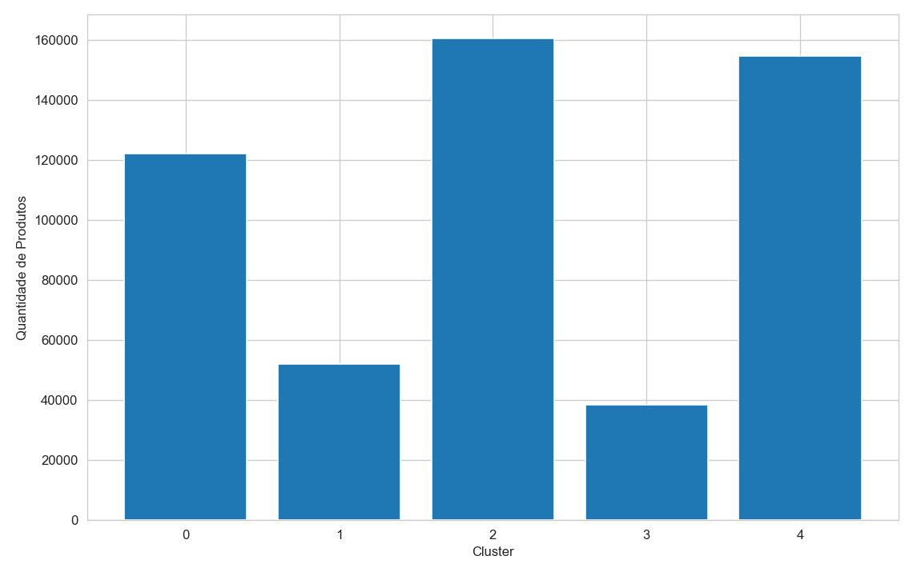
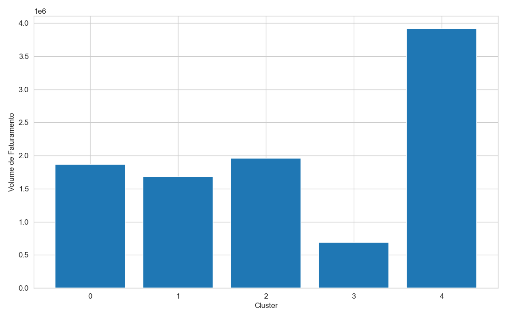
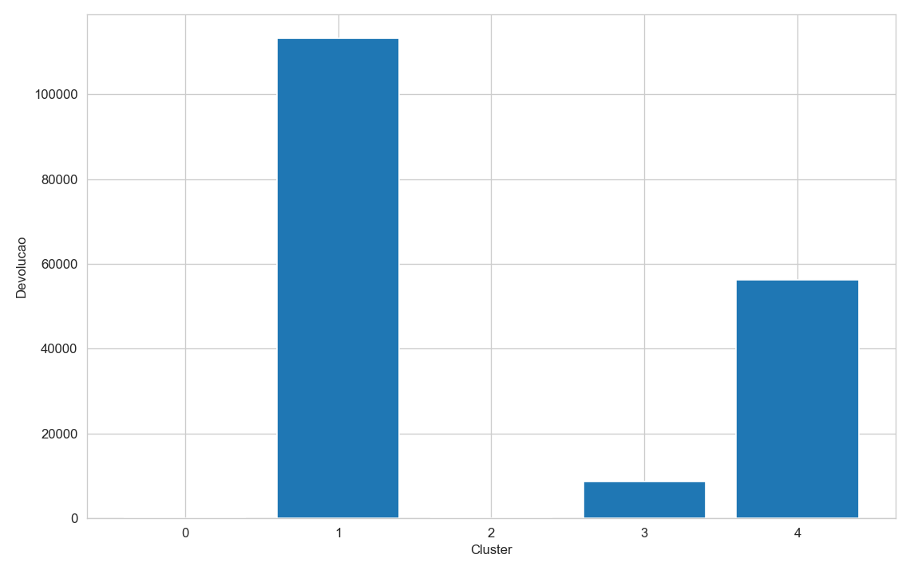
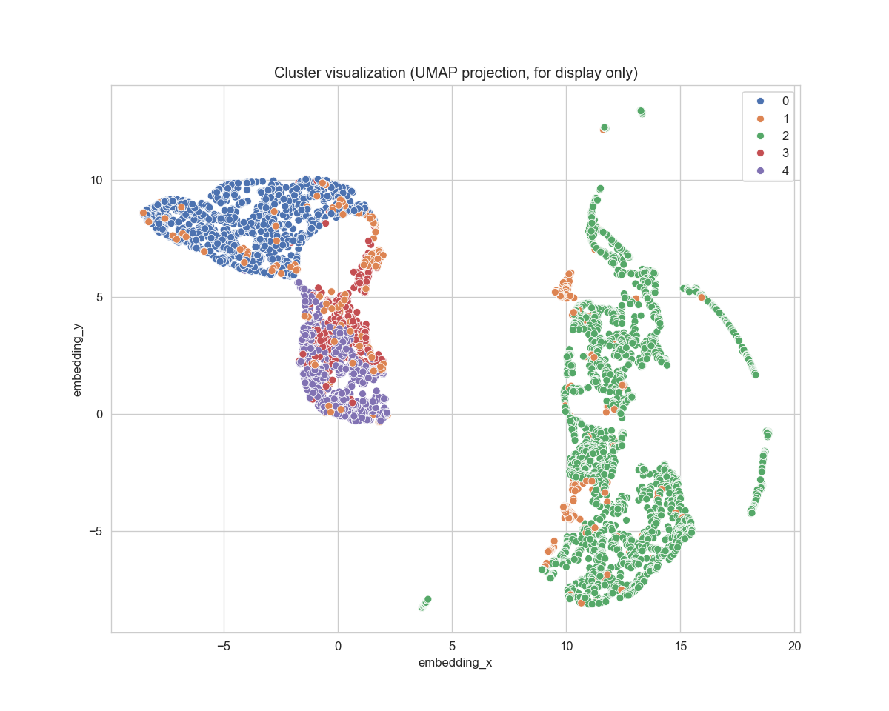
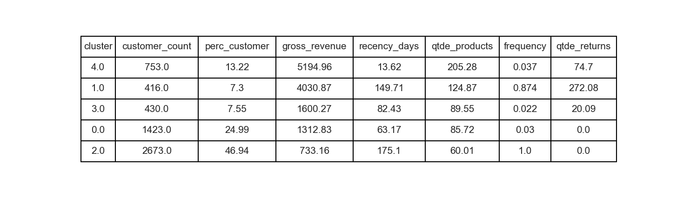

# Projeto: Programa de Fidelidade com Clusterização
<div align="center">    
  

                          Foto de NASA na Unsplash
    
</div>

## 1.0. Descrição
Uma empresa que comercializa produtos de segunda linha de várias marcas a um preço menor, através de um e-commerce.

Com pouco mais de 1 ano de operação, o time de marketing percebeu que alguns clientes frequentemente compram produtos mais caros, e assim, contribuem com uma parcela significativa do faturamento da empresa.

Com base nessa percepção, o time de marketing vai lançar um programa de fidelidade para os melhores clientes da base. Mas o time de marketing não possui conhecimentos avançados em análise de dados para eleger os participantes do programa.

Por esse motivo, o time de marketing requisitou ao time de dados, uma seleção de clientes elegiveis ao programa usando técnicas avançadas de manipulação de dados.

## 2.0. Objetivo
Selecionar os mais valiosos clientes para formar o programa de fidelidade "INSIDERS" utilizando um conjunto de dados com as vendas de produtos entre Novembro de 2015 até Dezembro 2017.

## 3.0. Produto Final
Uma tabela, ordenada pelo faturamento total do cluster com suas características. O cluster com maior faturamento será considerado os clientes "INSIDERS".

## 4.0. Algoritmos Ensaiados
Realizei os ensaios com os algoritmos: Kmeans, Gaussian Mixture Model(GMM), Hierarchical Clustering e DBSCAN.  

## 5.0. Ferramentas Utilizadas
Python 3.10, Scikit-learn e SciPy.

## 6.0. Estratégia da Solução
Para conseguirmos identificar o grupo "INSIDERS", iremos utilizar a técnica para Feature Engineering: RFM (Recência, Frequência e Monetização). Como essas features são fortemente assimétricas, aplicamos `log1p` antes do `MinMaxScaler` (Data Preparation) e definimos que a clusterização roda diretamente sobre esse espaço RFM escalado, e não sobre um embedding PCA/UMAP/t-SNE — usados somente para exploração visual (Feature Selection). A escolha do algoritmo e do número de clusters é guiada pela métrica de validação SS (Silhouette Score). Por último iremos fazer a visualização gráfica e separarmos os grupos entre INSIDERS e outros clusters.

## 7.0. O passo a passo
**Passo 01:** Descrição e filtragem dos dados

**Passo 02:** Realizar a Feature Engineering (RFM)

**Passo 03:** Análise Exploratória dos Dados (EDA) e estudo do espaço (PCA, UMAP, t-SNE e embedding de árvore, usados apenas para exploração visual)

**Passo 04:** Data Preparation (log1p + MinMaxScaler) e Feature Selection

**Passo 05:** Realizar ensaios com algoritmos de Machine Learning e métricas de validação de Clustering (SS)

**Passo 06:** Treinamento do modelo final

**Passo 07:** Análise de Cluster e teste das hipóteses de negócio

**Passo 08:** Deploy (persistência do modelo/scaler e exportação da tabela final)

## 8.0. Os top 3 insights
### 1. Os clientes do cluster 4 (insider) somam 29,31% do volume de produtos comprados, quase 3x o mínimo de 10% esperado.

### 2. Os clientes do cluster 4 (insider) somam 38,71% do faturamento (GMV) total, quase 4x o mínimo de 10% esperado.

### 3. O cluster 4 (insider) tem a média de devoluções (74,70) mais que o dobro da média geral (31,27).


## 9.0. Resultados
Utilizei o modelo de Machine Learning Gaussian Mixture (GMM), com k=5, para encontrarmos os agrupamentos (clusterização) para esses dados, alcançando um Silhouette Score de 0,072. O k=5 foi escolhido em vez do maior Silhouette Score estatístico (k=2, uma divisão grosseira da base ao meio) por isolar um segmento pequeno e acionável de clientes de elite, alinhado ao objetivo de negócio do programa INSIDERS.

Uma inspeção visual podemos entender os agrupamentos formados pelo modelo.


Por fim, podemos separar em informações relevantes para encontrarmos o grupo insiders, usando como referência o faturamento, e também de outros grupos para entregarmos para a equipe de negócios.


## 10.0. Conclusão
### Cluster Insider
    - Número de customers: 753 (13,22% dos clientes )
    
    - Faturamento médio: $5.194,96 dólares
    
    - Recência média: 13,62 dias
    
    - Média de Produtos comprados: 205 produtos
    
    - Frequência de compras: 0,04 compras/dia

## 11.0. Próximos Passos
Utilizar a computação em nuvem (AWS ou Google Cloud) representa uma estratégia avançada para otimizar nosso sistema. Propomos a criação de uma API integrada com nosso modelo, estabelecendo um ponto centralizado para a incorporação de novos dados. Essa abordagem permitirá não apenas a alocação eficiente dos dados, mas também a identificação do cluster mais adequado para a integração do novo cliente.

## 12.0. Como Executar o Projeto
**Pré-requisitos:** Python 3.10.

```bash
# 1. Criar e ativar um ambiente virtual
python -m venv .venv
.venv\Scripts\activate       # Windows
source .venv/bin/activate    # Linux/Mac

# 2. Instalar as dependências
pip install -r requirements.txt
```

O dataset bruto (`Ecommerce.zip`) já está incluído em `data/raw/` — não precisa ser extraído manualmente, o notebook lê direto de dentro do zip.

Depois, abra `notebooks/01_clusterizacao.ipynb` (Jupyter Notebook, JupyterLab ou VS Code) e execute todas as células em ordem, a partir da pasta `notebooks/` (os caminhos relativos do projeto — dados, modelos — são resolvidos a partir dela). Ao final da execução, o notebook sobrescreve:
- `models/scaler.pkl` e `models/gmm_model.pkl` (modelo e scaler treinados)
- `data/processed/customer_clusters.csv` e `data/processed/cluster_profile.csv` (tabela final do produto, seção 3.0)

## Licença
Distribuído sob a licença MIT. Veja [LICENSE](./LICENSE) para mais detalhes.
